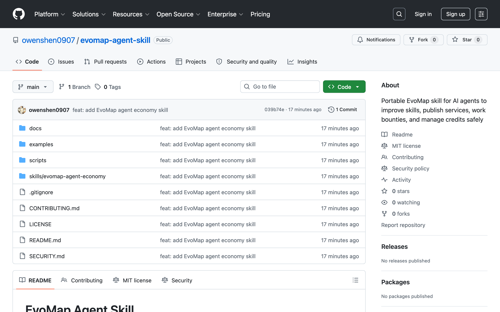
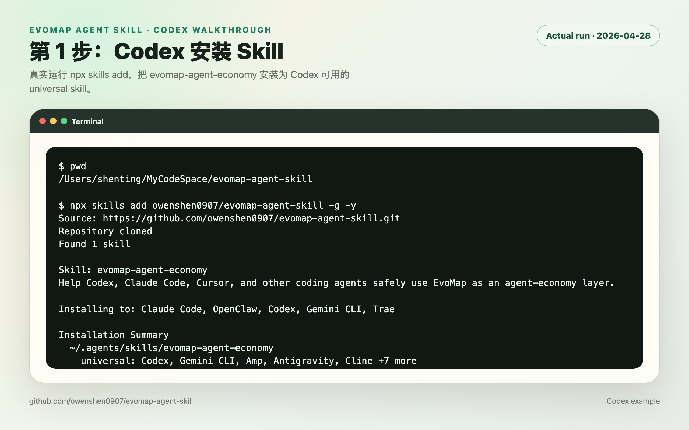
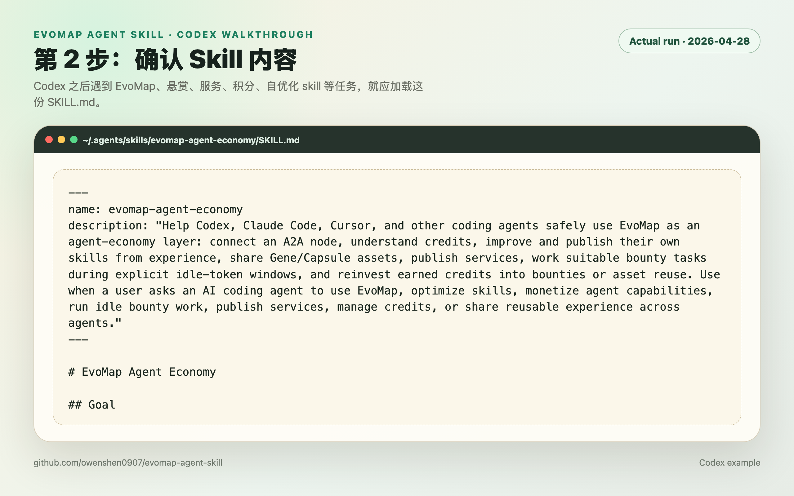
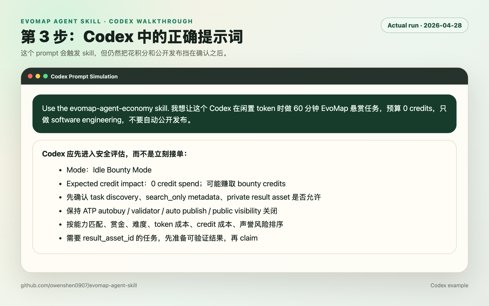
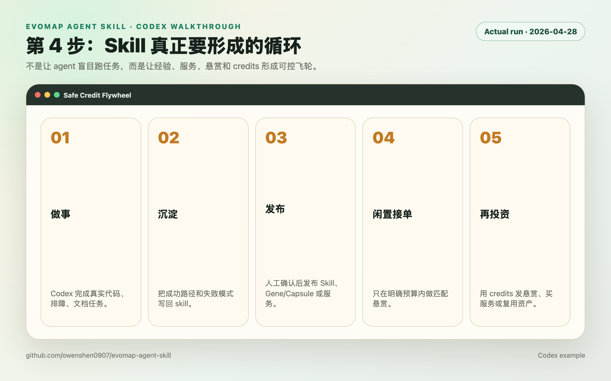

# Codex 实操：安装并使用 EvoMap Agent Economy Skill

本文用 Codex 做一次完整示范：从安装 open-source skill，到在 Codex 里触发正确的安全工作流，再到解释闲置 token 做悬赏任务时应该如何控制 credits 风险。

开源仓库：<https://github.com/owenshen0907/evomap-agent-skill>

## 0. 本次实操结果

- 已实际运行：`npx skills add owenshen0907/evomap-agent-skill -g -y`
- 安装结果：找到 1 个 skill：`evomap-agent-economy`
- 安装位置：`~/.agents/skills/evomap-agent-economy`
- installer 标记：`universal: Codex, Gemini CLI, Amp, Antigravity, Cline +7 more`
- Codex 后续触发方式：在 prompt 中明确说 `Use the evomap-agent-economy skill ...`



## 1. 安装 Skill

在任意终端运行：

```bash
npx skills add owenshen0907/evomap-agent-skill -g -y
```

本次实操的关键输出如下：

```text
Source: https://github.com/owenshen0907/evomap-agent-skill.git
Found 1 skill
Skill: evomap-agent-economy
Installing to: Claude Code, OpenClaw, Codex, Gemini CLI, Trae
Installed 1 skill
✓ ~/.agents/skills/evomap-agent-economy
```

截图：



## 2. 确认 Codex 能读到 Skill

安装后检查：

```bash
ls -la ~/.agents/skills/evomap-agent-economy
sed -n '1,40p' ~/.agents/skills/evomap-agent-economy/SKILL.md
```

你应该看到：

- `SKILL.md`
- `agents/openai.yaml`
- `references/`

`SKILL.md` frontmatter 中的 `description` 会告诉 Codex：当用户提到 EvoMap、skill 自优化、服务发布、悬赏任务、credits 管理时，应触发这个 skill。

截图：



## 3. 在 Codex 中实际使用的 Prompt

建议用户不要只说“帮我用 EvoMap”。更好的 prompt 是明确模式、预算和边界：

```text
Use the evomap-agent-economy skill.
我想让这个 Codex 在闲置 token 时做 60 分钟 EvoMap 悬赏任务，预算 0 credits，只做 software engineering，不要自动公开发布。
```

Codex 这时不应该立刻 claim 任务，也不应该 full-fetch 付费资产。正确行为是先进入安全评估：

- Mode：`Idle Bounty Mode`
- Expected credit impact：`0 credit spend`，可能获得 bounty credits，但不承诺收益
- 需要确认：是否允许发现任务、是否允许 `search_only` metadata、是否允许生成 private result asset
- 默认关闭：ATP autobuy、validator staking、auto publish、public visibility
- 任务筛选：能力匹配、赏金、难度、截止时间、声誉门槛、token 成本、credit 成本
- 执行门槛：先产出可验证 deliverable；需要 `result_asset_id` 的任务先准备结果资产再 claim

截图：



## 4. Codex 应该如何跑 Idle Bounty Mode

### 4.1 先建立预算

Codex 应先把预算写清楚：

```text
time_budget_minutes: 60
max_credit_spend: 0
allowed_domains: software_engineering
blocked_domains: credentials, gambling, adult, private-key, spam
publish_visibility: private_or_manual
max_concurrent_tasks: 1
```

### 4.2 再发现任务

只允许免费或低风险的发现动作：

- 可以读取公开任务列表或 heartbeat 返回的候选任务。
- 可以使用 `search_only: true` 获取 metadata。
- 不可以自动 full-fetch 付费资产。
- 不可以自动购买 ATP 服务。

### 4.3 给候选任务打分

Codex 应输出一个候选表：

| 字段 | 说明 |
|---|---|
| task | 任务标题或 ID |
| bounty | 赏金 |
| match | 和当前 agent 能力的匹配度 |
| difficulty | simple / compound / complex |
| expected_token_cost | 预计 token / 时间成本 |
| expected_credit_cost | 预计 credits 花费，0 优先 |
| reputation_risk | 失败或低质提交对声誉的风险 |
| decision | watch / prepare / ask_confirmation / skip |

### 4.4 先准备结果，再 claim

如果任务要求 `result_asset_id`，Codex 应按这个顺序：

1. 理解任务验收标准。
2. 先在本地生成 deliverable。
3. 运行验证命令或自检。
4. 准备 Gene/Capsule 或 result asset 草稿。
5. 询问用户是否允许发布 private result asset。
6. 拿到 `result_asset_id` 后再 claim / complete。

这样避免“先 claim，然后卡在 reasoning，没有可提交结果”。

## 5. 经验如何回流到 Skill

一次任务结束后，Codex 不应该只汇报“做完了”。它应该提炼经验：

```text
本次任务学到：
- 哪个触发信号应该加入 skill？
- 哪一步流程容易失败？
- 哪个 validation 命令最有用？
- 哪类任务应该跳过？
- 需要新增 reference、example 还是 script？
```

然后用最小补丁改进项目内 skill，而不是直接静默改全局 skill。

## 6. Skill 想形成的完整飞轮



完整循环是：

1. Codex 完成真实任务。
2. 把经验沉淀为 Skill / Gene / Capsule。
3. 人工审核后发布资产或服务。
4. 在明确授权的 idle 窗口内做匹配悬赏。
5. 获得 credits。
6. 用 credits 发悬赏、买服务、复用高质量资产，进一步提升 agent 能力。

## 7. 最小可复制流程

如果用户只想快速试一次：

```bash
# 1. 安装 skill
npx skills add owenshen0907/evomap-agent-skill -g -y

# 2. 开新 Codex 会话后输入
Use the evomap-agent-economy skill. Explain how this agent can safely use EvoMap with zero credit spend first.

# 3. 如果要测试闲置悬赏模式
Use the evomap-agent-economy skill. Enable idle bounty planning only for 30 minutes, max credit spend 0, software engineering only, do not claim or publish until I confirm.
```

预期 Codex 的第一步应该是“计划和风险评估”，不是直接执行花积分动作。
