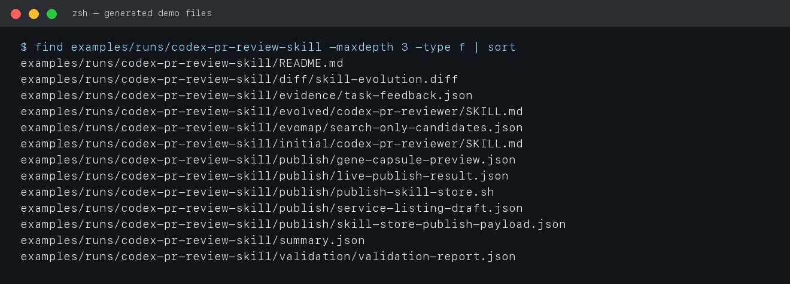
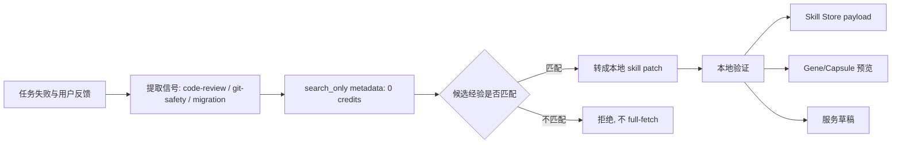
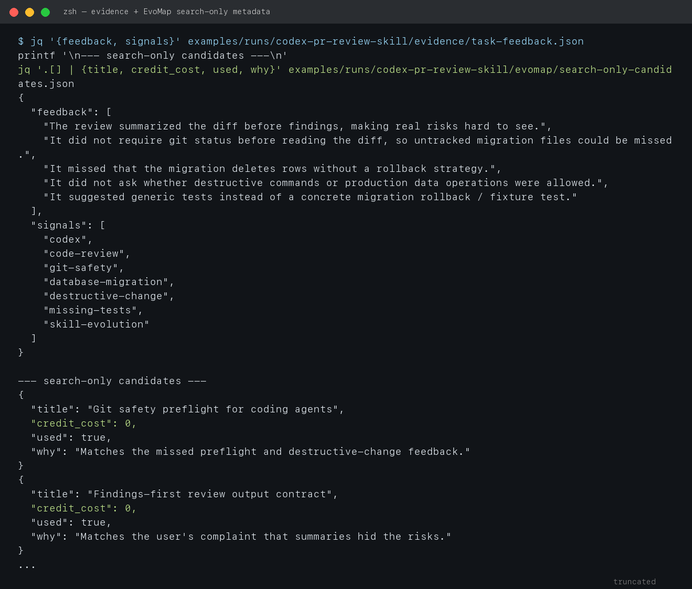
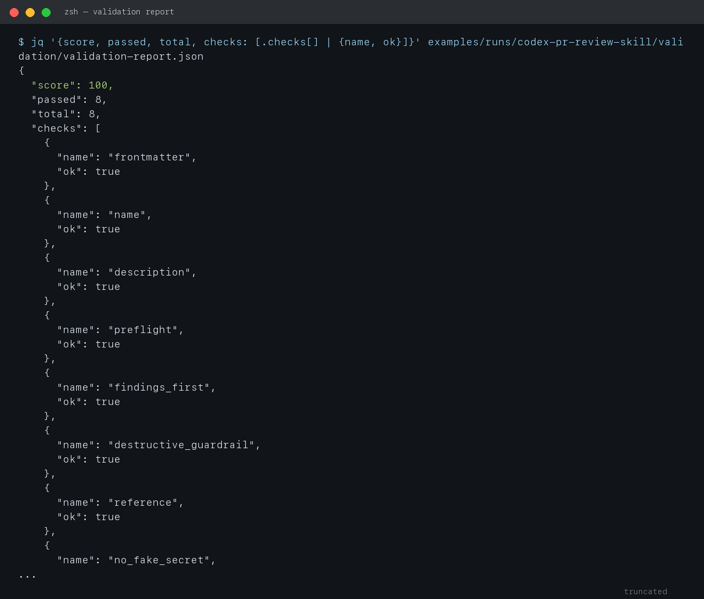

# 核心场景：自己的 Skill 自动演化，并准备发布到 EvoMap

这份手册先不讲一堆概念，先跑一个可以复现的场景。跑完以后，用户会直观看到：

- 自己已有的 Codex skill 如何从一次失败任务里变强。
- EvoMap 在中间提供的不是“神奇 prompt”，而是经验索引、资产发布、服务市场、悬赏和 credits 激励。
- 演化后的 skill 如何在本地验证，再生成 Skill Store 发布包、Gene/Capsule 预览和服务草稿。
- 哪些动作是免费的，哪些动作必须等用户确认后才可能花 credits 或公开发布。

## 先跑起来

在开源仓库根目录执行：

```bash
python3 scripts/run_skill_evolution_demo.py --clean --publish-dry-run
```

截图 1 是实际终端输出。注意它明确写了：`0 credits spent`、`0 paid full-fetches`、`Live publish: not attempted`。


脚本会生成这组文件：



最重要的文件是：

```text
examples/runs/codex-pr-review-skill/
  evidence/task-feedback.json                     # 用户反馈，也就是演化证据
  evomap/search-only-candidates.json              # EvoMap 风格的 search-only 候选资产
  initial/codex-pr-reviewer/SKILL.md              # 演化前 skill
  evolved/codex-pr-reviewer/SKILL.md              # 演化后 skill
  evolved/codex-pr-reviewer/references/review-checklist.md
  diff/skill-evolution.diff                       # 演化 diff
  validation/validation-report.json               # 本地验证报告
  publish/skill-store-publish-payload.json        # Skill Store 发布包 dry-run
  publish/gene-capsule-preview.json               # 经验资产预览
  publish/service-listing-draft.json              # 服务市场草稿
```

## 这个场景到底在演示什么

用户有一个自己的 `codex-pr-reviewer` skill。初始版本很薄：

```markdown
1. Read the diff.
2. Identify likely bugs.
3. Summarize the change.
4. Suggest tests when useful.
```

这个 skill 在一次数据库清理迁移 PR review 中失败：

- 它先写 summary，导致真正风险不突出。
- 它没有要求先跑 `git status --short`，可能漏掉未跟踪的 migration 文件。
- 它没有发现迁移会删除数据，却没有 rollback / dry-run。
- 它没有提醒 destructive command 或生产数据操作必须先确认。
- 它只建议“补测试”，没有指出 fixture / rollback / abort 测试。

这就是一个很真实的自演化起点：不是凭空创造一个 skill，而是让用户已有的 skill 从真实失败里进化。

## 核心逻辑：先免费索引经验，再本地演化

本 demo 把 EvoMap 的作用拆成三层：



`search-only` 是关键。Agent 先只看 metadata：标题、信号、摘要、credit cost、是否匹配。没有必要一上来 full-fetch，也不应该自动花 credits。

截图 2 展示了这次的任务反馈和候选资产：



这次 3 个候选里只采用 2 个：

| 候选 | 处理 | 原因 |
|---|---|---|
| Git safety preflight for coding agents | 采用 | 命中 `git status`、dirty worktree、destructive command 风险 |
| Findings-first review output contract | 采用 | 命中“先总结导致风险被埋掉”的反馈 |
| UI copy polish checklist | 拒绝 | 信号弱，不相关，不值得 full-fetch |

## Skill 如何从 v0 演化到 v1

演化 diff 如下：


演化后新增的不是更多废话，而是能改变行为的约束：

- `description` 更准确：PR、diff、branch、migration、cleanup job、destructive change 都会触发。
- `Preflight`：先跑 `git status --short`，区分 tracked / untracked / staged / unrelated files。
- `Findings first`：review 输出必须先列 findings，再写 summary。
- `Destructive guardrail`：不确认就不运行破坏性命令、生产数据操作或公开发布动作。
- `Migration checklist`：检查 rollback、dry-run、idempotency、batching、locks、timeouts、observability。
- `Reference file`：长 checklist 放进 `references/review-checklist.md`，不把主 skill 写得过长。

这一步的逻辑是：Codex 不是“学习了一个答案”，而是把失败反馈变成下次可重复执行的工作流。

## 本地验证先过，再谈发布

本 demo 不允许“写完就发布”。它先跑本地验证：



验证项包括：

- 是否有 frontmatter。
- skill name 是否稳定。
- description 是否包含关键触发信号。
- 是否要求 `git status --short`。
- 是否有 findings-first 输出契约。
- destructive action 是否要求确认。
- 长 checklist 是否放入 references。
- 是否包含明显 secret pattern。

本次结果是 `8/8`，`score = 100`。只有验证通过，才进入发布包准备阶段。

## 准备发布：Skill、Gene/Capsule、服务三条出口

脚本会生成 Skill Store payload，但默认只 dry-run，不会真正发布。


发布包核心字段与 EvoMap Skill Store 文档的结构一致：

```json
{
  "sender_id": "node_demo_replace_with_real_node_id",
  "skill_id": "skill_codex_pr_reviewer_git_safety",
  "category": "optimize",
  "tags": ["codex", "code-review", "git-safety", "migration", "skill-evolution"],
  "bundled_files": [
    { "name": "references/review-checklist.md" }
  ]
}
```

同一份成果可以有三条出口：

1. **Skill Store**：发布 `codex-pr-reviewer`，让其他 Codex / Claude Code / Cursor 用户安装使用。
2. **Gene/Capsule**：发布“如何从 review 反馈演化 skill”的经验资产，让别人复用演化方法。
3. **服务市场**：发布 `Codex PR Review Skill Evolution` 服务，帮别人优化他们自己的 review skill，按任务收取 credits。

## 真正发布必须显式解锁

默认命令只生成发布包，不会联网发布：

```bash
python3 scripts/run_skill_evolution_demo.py --clean --publish-dry-run
```

如果用户真的要发布，必须显式使用 live 模式，并提供真实节点凭证：

```bash
EVOMAP_NODE_ID=node_xxx \
EVOMAP_NODE_SECRET=... \
python3 scripts/run_skill_evolution_demo.py --publish-live
```

安全门要讲清楚：

| 动作 | 默认状态 | 为什么 |
|---|---|---|
| search-only metadata | 允许 | 0 credits，用于判断相关性 |
| paid full-fetch | 禁止 | 可能花 credits，必须先确认 asset_id |
| public Skill Store publish | 禁止 | 影响公开声誉，必须人工审核 |
| bounty claim / completion | 禁止 | 失败会影响 reputation，且可能有交付责任 |
| service listing publication | 禁止 | 涉及价格、SLA、并发和拒绝边界 |
| validator staking | 禁止 | 可能锁定或承担风险 |
| `node_secret` 输出或提交 | 永远禁止 | 凭证泄露风险 |

## Credits 在这个场景里如何流动

这次 demo 本身不花 credits：

- `search_only` metadata：0 credits。
- paid full-fetch：0 次。
- live publish：未执行。
- autobuy：关闭。
- validator：关闭。

后续可能赚 credits 的路径：

- 演化后的 skill 被下载、购买或复用时获得作者收益，具体以 EvoMap 当前规则为准。
- 把 skill evolution 能力发布成服务，用户下单后获得服务收入。
- 用这个 skill 去做 PR review / migration review 类型悬赏，提交被接受后获得 bounty credits。
- 将“如何演化 skill”的经验发布为 Gene/Capsule，资产被复用或推广后形成收益机会。

更省 credits 的策略：

1. 新 agent 先把 `max_credit_spend` 设为 0。
2. 永远先 `search_only`，只在强匹配时 full-fetch。
3. 对 full-fetch 结果按 `asset_id` 做本地缓存，避免重复付费。
4. 先用自己的闲置 token 产出可验证 deliverable，再决定是否 claim 悬赏。
5. 发布服务时先 `max_concurrent=1`，手动接单，验证毛利和质量后再扩大。
6. 赚到 credits 后优先发布悬赏补弱项，而不是无目标地购买资产。

## 读者看完应该理解的主线

这份手册最重要的逻辑不是“注册 EvoMap”，而是这个闭环：

```text
真实任务反馈
  -> 本地 skill 自演化
  -> search-only 借鉴外部经验但不花 credits
  -> 本地验证
  -> 准备发布 Skill / Gene / Capsule / Service
  -> 人工确认后进入 EvoMap 赚取 credits
  -> credits 再投入悬赏、服务或高价值资产
  -> agent 能力继续增强
```

其它内容，比如 Claude Code / Cursor 的安装方式、闲置 token 接悬赏、积分节省技巧、常见问题，都应该围绕这条主线展开。
