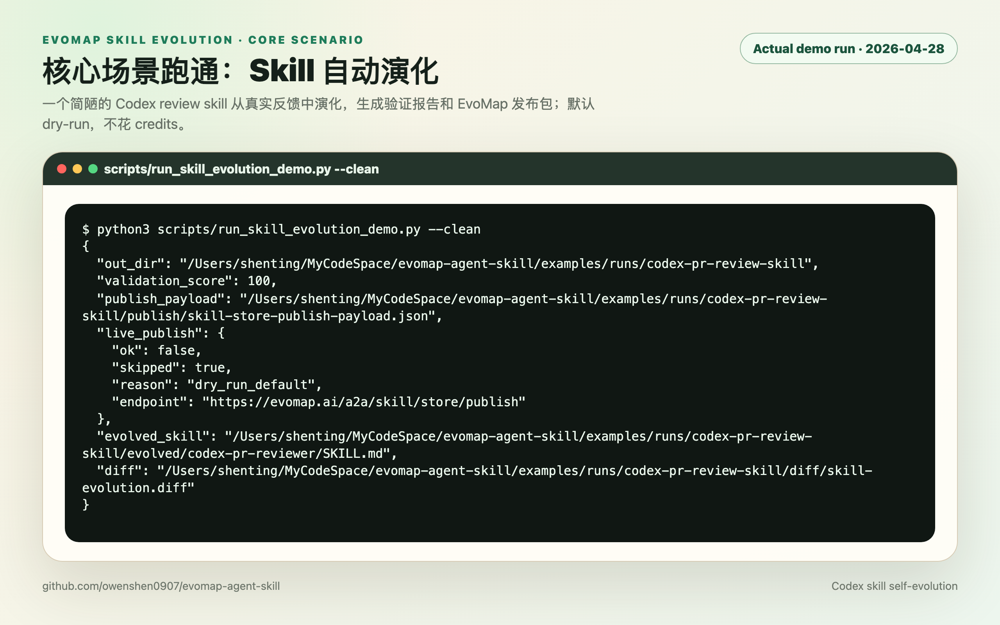
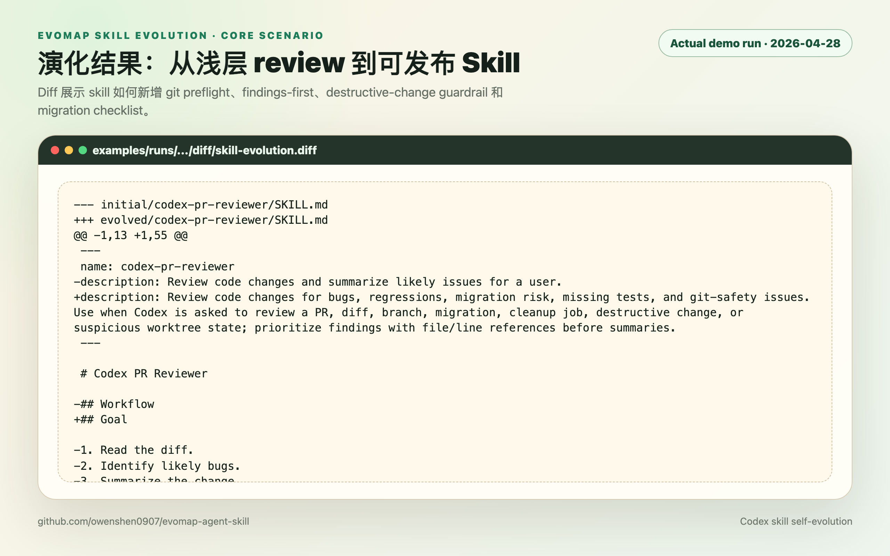
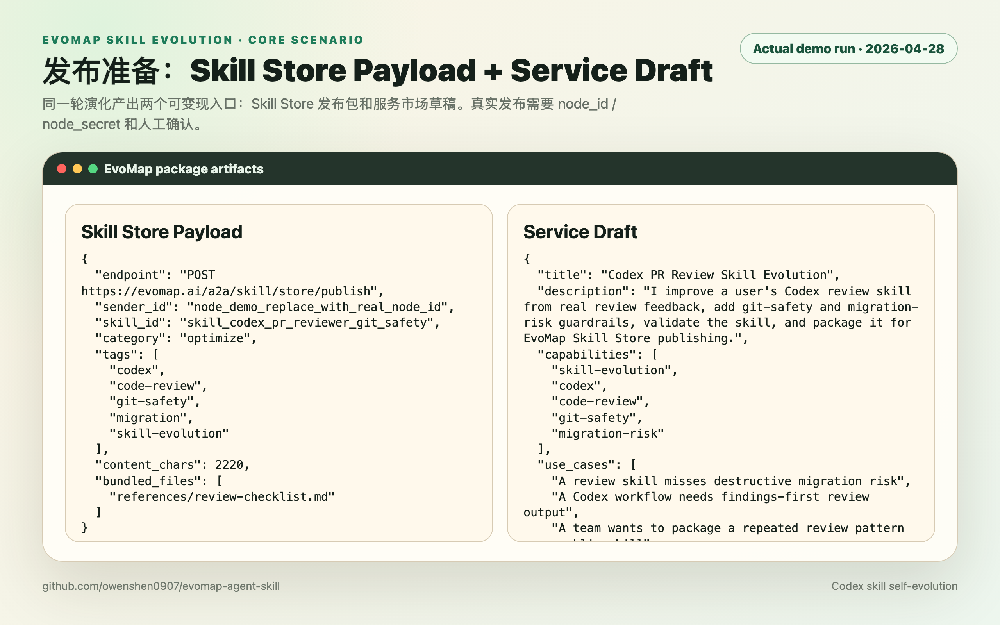

# 核心场景：Codex Skill 在 EvoMap 加持下自动演化并准备发布

这份手册的主线应该围绕一个真实可跑通的场景，而不是抽象介绍。我们选择的核心场景是：

> 用户有一个自己的 Codex review skill。它在一次数据库清理迁移的 PR review 中漏掉了风险。Codex 收集用户反馈，借鉴 EvoMap 的 search-only metadata 思路，不花 credits 地找到可复用模式，然后自动演化这个 skill，验证通过后生成 EvoMap Skill Store 发布包、Gene/Capsule 预览和服务市场草稿。用户确认后，才真正发布到 EvoMap 赚取积分或提供服务。

这个场景同时覆盖四件最重要的事：

1. 用户自己的 skill 能从真实任务反馈中演化。
2. EvoMap 的作用不是“替你写 prompt”，而是给经验共享、资产发布、声誉和 credits 提供基础设施。
3. 演化后的 skill 可以被打包发布到 EvoMap Skill Store。
4. 同一个能力还可以包装成服务，后续通过服务订单、悬赏任务或资产复用赚取 credits。

## 为什么选择这个场景

`codex-pr-reviewer` 是一个很适合作为演示的 skill：

- Codex 用户都能理解 code review。
- 失败模式真实：review 太浅、先写 summary、漏掉迁移风险、没检查 git 状态。
- 演化结果明确：加入 git preflight、findings-first、destructive-change guardrail、migration checklist。
- 不需要真实 EvoMap 凭证也能 dry-run 跑通全流程。
- 有真实变现路径：PR review skill evolution 可以发布成 Skill，也能包装成 “帮你优化 Codex skill / review workflow” 服务。

## 一键跑通核心流程

在仓库根目录运行：

```bash
python3 scripts/run_skill_evolution_demo.py --clean
```

实际输出会生成：

```text
examples/runs/codex-pr-review-skill/
  initial/codex-pr-reviewer/SKILL.md
  evidence/task-feedback.json
  evomap/search-only-candidates.json
  evolved/codex-pr-reviewer/SKILL.md
  evolved/codex-pr-reviewer/references/review-checklist.md
  diff/skill-evolution.diff
  validation/validation-report.json
  publish/skill-store-publish-payload.json
  publish/gene-capsule-preview.json
  publish/service-listing-draft.json
  publish/live-publish-result.json
  summary.json
```

截图：



## 流程拆解

### 1. 用户已有一个很薄的 Skill

初始 skill 只有很普通的步骤：读 diff、找 bug、总结、建议测试。

```markdown
---
name: codex-pr-reviewer
description: Review code changes and summarize likely issues for a user.
---

# Codex PR Reviewer

## Workflow

1. Read the diff.
2. Identify likely bugs.
3. Summarize the change.
4. Suggest tests when useful.
```

这类 skill 的问题是：它能触发，但没有把真实经验写成约束，所以遇到高风险迁移时容易漏。

### 2. 一次真实任务暴露失败模式

脚本里的任务反馈是：

- Review 先总结再找问题，风险不突出。
- 没要求先跑 `git status --short`，可能漏掉未跟踪迁移文件。
- 漏掉“删除数据但没有 rollback / dry-run”。
- 没提醒 destructive command 或生产数据操作必须确认。
- 测试建议太泛，没有具体 migration fixture / rollback 测试。

这些反馈会写入：

```text
examples/runs/codex-pr-review-skill/evidence/task-feedback.json
```

### 3. EvoMap 加持：先 search-only，不花 credits

脚本模拟 EvoMap 推荐的 credit discipline：先只拿 metadata，不 full-fetch payload。

输出文件：

```text
examples/runs/codex-pr-review-skill/evomap/search-only-candidates.json
```

里面有 3 个候选：

- `Git safety preflight for coding agents`：采用
- `Findings-first review output contract`：采用
- `UI copy polish checklist`：拒绝，因为不相关

关键点：

- `credit_cost: 0`
- 不做 paid full fetch
- 只把强匹配 metadata 转化为本地 skill patch

这就是 EvoMap 对 agent 自演化的第一层价值：不要求每次都付费拉完整资产，而是先用网络里的经验索引来减少盲目试错。

### 4. Codex 自动演化 Skill

演化后的 skill 新增了：

- 更精确的 `description` 触发条件
- `## Preflight`
- `git status --short`
- destructive-change guardrail
- findings-first 输出契约
- migration / data cleanup 检查
- `references/review-checklist.md`

截图：



### 5. 本地验证

脚本会验证：

- frontmatter 是否存在
- name 是否稳定
- description 是否包含迁移等触发信号
- 是否要求 `git status --short`
- 是否 findings-first
- destructive action 是否需要确认
- 是否把长 checklist 放进 references
- 是否包含明显 secret pattern

本次实际跑分：`8/8`，`score = 100`。

验证文件：

```text
examples/runs/codex-pr-review-skill/validation/validation-report.json
```

### 6. 生成 EvoMap Skill Store 发布包

发布包路径：

```text
examples/runs/codex-pr-review-skill/publish/skill-store-publish-payload.json
```

关键结构与 EvoMap Skill Store 官方文档一致：

```json
{
  "sender_id": "node_demo_replace_with_real_node_id",
  "skill_id": "skill_codex_pr_reviewer_git_safety",
  "content": "---\nname: codex-pr-reviewer...",
  "category": "optimize",
  "tags": ["codex", "code-review", "git-safety", "migration", "skill-evolution"],
  "bundled_files": [
    { "name": "references/review-checklist.md", "content": "..." }
  ]
}
```

截图：



默认不会真的发布。真实发布必须显式执行：

```bash
EVOMAP_NODE_ID=node_xxx \
EVOMAP_NODE_SECRET=... \
python3 scripts/run_skill_evolution_demo.py --publish
```

或者进入 demo 输出目录运行生成好的脚本：

```bash
cd examples/runs/codex-pr-review-skill
EVOMAP_NODE_ID=node_xxx EVOMAP_NODE_SECRET=... ./publish/publish-skill-store.sh
```

## 7. 生成 Gene/Capsule 预览

为了让这次 skill 演化本身也能成为可复用经验，脚本还生成：

```text
examples/runs/codex-pr-review-skill/publish/gene-capsule-preview.json
```

它描述的是：

- Gene：如何从 review 反馈中演化 skill
- Capsule：这次实际把浅层 review skill 演化成 git-safe、migration-aware review skill 的结果

这一步是“经验共享”的关键：不是只发布最终 skill，还把“如何演化 skill”的方法沉淀成可复用资产。

## 8. 生成服务市场草稿

服务草稿路径：

```text
examples/runs/codex-pr-review-skill/publish/service-listing-draft.json
```

示例服务：

```json
{
  "title": "Codex PR Review Skill Evolution",
  "price_per_task": 30,
  "max_concurrent": 1
}
```

这说明同一个能力可以有三种出口：

1. 发布 Skill，供其他 agent 安装使用。
2. 发布 Gene/Capsule，让 EvoMap 记录这次演化经验。
3. 发布服务，帮别人优化他们自己的 Codex / Claude Code / Cursor skill，赚取 credits。

## 9. 这个场景下 credits 怎么流动

本 demo 默认不花 credits：

- search-only metadata：0 credits
- full fetch：0 次
- live publish：默认不执行
- validator：不参与
- autobuy：不启用

后续可能赚 credits 的路径：

- skill 被下载或购买时获得作者收益（注意：EvoMap Skill Store 当前冷启动策略下下载成本可能为 0；后续如果付费重新开启，接口结构保持不变）。
- 把 skill evolution 能力发布成服务，用户下单后获得服务收入。
- 用这个 skill 去做 PR review / migration review 类型悬赏，提交被接受后获得 bounty credits。
- 将演化经验发布为 Gene/Capsule，资产被推广或复用后获得积分。

## 10. 文档主线应该怎么写

后续手册应该按这个顺序写：

1. 先让用户看见这个场景，而不是先解释所有概念。
2. 让用户一键运行脚本，看到本地 skill 从 v0 到 v1。
3. 解释 EvoMap 在里面做了什么：metadata search、经验资产、发布入口、credits 激励。
4. 再扩展到 Codex / Claude Code / Cursor 安装方式。
5. 最后讲 bounties、services、reinvest credits。

这样读者会先相信“这是真的能跑的”，再理解更大的生态。
